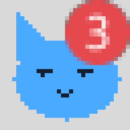
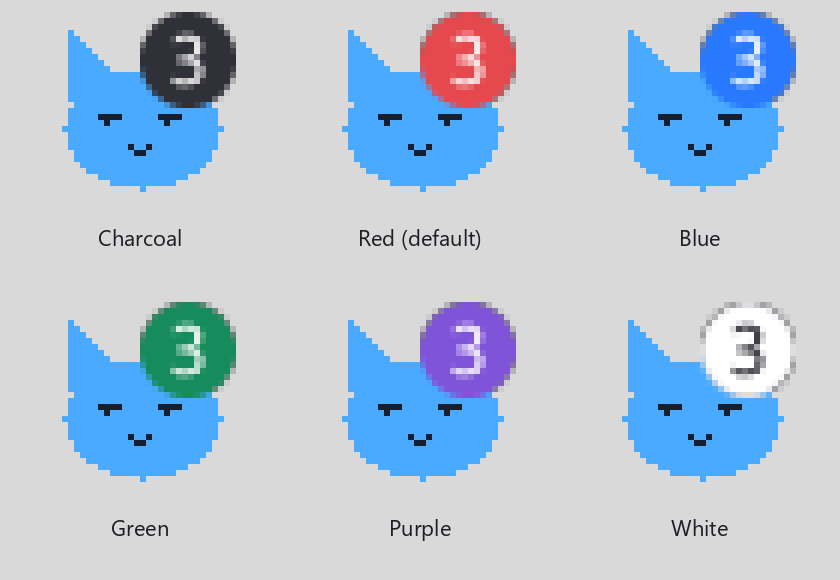
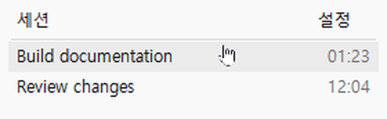

# Codex Tray Pet

> **Solo Windows x64. Requiere la aplicación de escritorio Codex para Windows. No es compatible con macOS ni Linux.**

[English](../../README.md) · [한국어](README.ko.md) · [日本語](README.ja.md) · [简体中文](README.zh-CN.md) · [Español](README.es.md)

Un pequeño gato animado en el área de notificaciones de Windows que muestra el estado de tus tareas en Codex. Su lista de sesiones permite ver tareas en curso, preguntas, interrupciones por límites de uso y resultados sin leer.

Está escrito en C con la API de Windows. La aplicación residente no necesita Python, Node.js, .NET ni un navegador integrado. Es un proyecto independiente, sin afiliación con OpenAI.

El idioma predeterminado es **inglés**. El primer elemento del menú de ajustes y la parte superior de los ajustes del navegador permiten elegir **English, 한국어, 日本語, 简体中文 o Español**. La selección se guarda y se conserva al reiniciar. Cambia menús, información del icono, etiquetas de la lista, mensajes y ajustes del navegador. Los títulos de las sesiones y los nombres de proyectos conservan su texto original.

La aplicación supervisada es **Codex para Windows**. Su proceso se llama `ChatGPT.exe`, pero pertenece al paquete `OpenAI.Codex`. No supervisa la aplicación normal de ChatGPT ni conversaciones en chatgpt.com.

## Ejemplos

Captura real de la bandeja de Windows proporcionada por el autor:


Animaciones ampliadas generadas con el código de dibujo del programa:


Son iconos de 32×32 ampliados, no grabaciones de escritorio. Conservan formas, colores y proporciones. El contador usa el rojo predeterminado sin el pulso temporal de finalización:



En **Configuración → Color del contador** puedes elegir carbón, rojo (predeterminado), azul, verde, morado o blanco. Estos ejemplos mantienen el mismo gato y tamaño del contador sobre un fondo gris de la barra de tareas.



Ejemplos de ventanas creados con el mismo código de Windows y títulos ficticios:


Las tareas en curso muestran el tiempo transcurrido; los resultados completados sin leer, un punto azul; las preguntas, un `?` rodeado por un círculo; y los límites de uso, una `i` roja. Los errores normales sin leer también usan un punto azul en la lista; el gato de la bandeja pasa a rojo.

Al pasar el ratón sobre una sesión, la fila se vuelve gris claro y el cursor toma forma de mano. Haz clic en el título para abrir esa sesión en Codex mediante `codex://threads/<ID de sesión>`. El enlace solo se abre al hacer clic.



Estos ejemplos muestran el idioma inglés predeterminado. No se generaron con IA ni mediante una nueva captura de pantalla. Consulta la [procedencia y reproducción de imágenes](../MEDIA.md).

## Instalación

1. Descarga `codex-tray-pet-v0.2.0-windows-x64.zip` desde [Releases](https://github.com/Max-JI64/codex-tray-pet/releases).
2. Extrae el ZIP en una carpeta que vayas a conservar. Si la mueves, registra de nuevo la ruta de inicio.
3. Ejecuta `Install.cmd`: registra una tarea al iniciar sesión con tu usuario y arranca el monitor.
4. Si el gato está oculto, muévelo fuera del menú `^` del área de notificaciones.

Usa `Start.cmd` para iniciarlo manualmente. `Uninstall.cmd` elimina el inicio automático y detiene esa instalación, pero conserva archivos y ajustes. Los scripts no reemplazan ni eliminan tareas del mismo nombre que pertenezcan a otra carpeta. Antes de cambiar de carpeta, ejecuta el desinstalador de la copia anterior.

Los lanzadores de instalación y desinstalación aplican `-ExecutionPolicy Bypass` solo a su propio proceso de PowerShell para ejecutar los auxiliares descargados sin firma. No cambian la política persistente de Windows ni del usuario. Las políticas impuestas por una organización pueden impedir la instalación. El instalador comprueba que el proceso nuevo permanece activo antes de informar de éxito.

Cerrar la ventana de Codex no detiene la supervisión si sigue en segundo plano. Al elegir **Exit** en su menú de bandeja, desaparece el gato y se liberan sus recursos activos. Un pequeño monitor permanece para detectar el siguiente inicio de Codex.

## Estados

| Estado | Gato predeterminado |
|---|---|
| En espera | Gris |
| Trabajando | Azul, animado |
| Completado | Verde |
| Pregunta | Amarillo con interrogación |
| Error | Rojo con exclamación |
| Detenido | Morado |
| Detección incierta | Gris oscuro |
| Uso agotado | Rojo intermitente y movimiento urgente |
| Tarea de más de 10 minutos | Movimiento lento y reloj de arena |

El contador sin leer puede aparecer mientras otras tareas continúan. Su color predeterminado es rojo y se puede cambiar. Leer un resultado en Codex lo retira de la lista de resultados sin leer. El orden se mantiene mientras la lista está abierta. Al pasar el ratón por una sesión, se muestra su proyecto en una línea a la derecha o, si no cabe, a la izquierda.

## Ajustes e imágenes propias

Haz clic en **Settings** en la lista de sesiones. **Change icon...** y **Open settings in browser...** abren los ajustes en el navegador predeterminado. Si ese navegador es Chrome, se usa Chrome; no se incluye ni se mantiene abierto como parte del monitor.

| Función | Menú nativo | Navegador |
|---|---|---|
| Idioma | Primera opción, cinco idiomas | Selector en la parte superior y botón Guardar idioma |
| Detección automática | Sí | Sí |
| Vista previa de estados, límites, tareas largas y contador | Sí | Sí; también cambia el icono real |
| Color del contador | Carbón, rojo, azul, verde, morado, blanco | Los mismos seis colores y guardado |
| Animación y cambios de color | Interruptor | Interruptor y guardado |
| Mascota propia o gato predeterminado | Abre el navegador | Selección y guardado |
| Subir animaciones | Abre el navegador | GIF o PNG/ICO, estado, intervalo, conversión, vista previa y aplicación |
| Guía para crear personajes | En el navegador | Personaje, movimiento, intervalo y copia del prompt para ChatGPT |
| Confirmar avisos o límite de uso | Sí | Sí |
| Ocultar en esta ejecución o detener el monitor | Sí | Sí |
| Actualizar, volver al icono actual o cerrar la conexión | Abrir de nuevo | Botones propios |

Puedes usar **tus propias imágenes estáticas o animadas**. Un conjunto por estado tiene prioridad sobre el conjunto común; si no hay ninguno, se usa el gato predeterminado. La guía genera un prompt para crear imágenes, no redibuja las que subes. Confirmar un aviso no cambia el estado de lectura en Codex ni restaura el uso agotado de la cuenta.

- Un GIF o hasta ocho PNG/ICO por conjunto.
- Cada archivo: máximo **1MiB**, ancho y alto de hasta **512px**.
- GIF original: máximo **120 fotogramas**.
- Se guardan hasta **8 fotogramas de 32×32 RGBA**, con intervalos de **150–2.000ms**.
- El recorte compartido conserva el movimiento entre fotogramas. Los iconos personalizados no tienen una barra inferior de estado.

Solo permanecen en memoria los fotogramas del estado activo. Ocho fotogramas usan 32KiB de píxeles; eso no es la memoria total de la aplicación. Los iconos de Windows y la conversión temporal del navegador requieren memoria adicional. Los ajustes web funcionan cuando se solicitan, en el mismo proceso nativo.

## Detección y privacidad

Lee registros locales de sesiones, estado de lectura y proyectos desde `CODEX_HOME` o `.codex` en el perfil del usuario. No modifica los archivos de Codex. Solo lee en memoria los identificadores de cuenta necesarios para asociar el estado de lectura y no los envía al exterior.

Los ajustes usan un puerto temporal en `127.0.0.1`, con validación de clave, Origin y Host. La conexión se cierra por solicitud, después de diez minutos sin peticiones API o al salir de Codex. Los diccionarios de idiomas están incluidos: no se usa un servicio de traducción ni un proceso adicional.

Se detectan eventos como `task_started`, `task_complete`, errores estructurados y llamadas a herramientas de preguntas. Pueden perderse cambios visibles solo en la interfaz, preguntas de texto normal y errores no registrados. Los formatos internos de Codex pueden cambiar. No se usa una API oficial de estado en tiempo real. Se siguen hasta 256 sesiones de aproximadamente los últimos siete días. Los contenidos grandes pasan por búferes limitados y solo se conserva información de estado.

La instalación pública v0.1.1 se descargó y se instaló realmente en el PC del autor. Se verificaron desinstalación, registro de inicio, proceso, detección de Codex, registro de bandeja y ausencia de duplicados. Consulta la [validación](../INSTALLATION-VALIDATION.md). La versión con idiomas tiene ocho comprobaciones nativas y pruebas de traducción del navegador. No se han verificado otro PC, un reinicio de Windows ni una salida y reapertura real de Codex. El ejecutable no está firmado.

## Compilar

Se necesita [TinyCC para Windows x64](https://bellard.org/tcc/). No se incluye el compilador.

```powershell
.\scripts\Build.ps1 -TccPath 'C:\tools\tcc\tcc.exe'
.\scripts\Test.ps1
.\scripts\Package.ps1
```

Las salidas de compilación van a `build` y los ZIP a `dist`. Las imágenes de documentación requieren Python y Pillow, pero ejecutar la mascota no los necesita. Edita los diccionarios en `assets/*-translations.json` y ejecuta `node tools/generate-localization.cjs` para regenerar las traducciones. `node tools/test-localization.cjs` comprueba los cambios de idioma sin controlar el navegador.

No se publican sesiones personales, credenciales, registros locales ni imágenes subidas por usuarios.

## Licencia

Aún no se ha elegido una licencia de distribución. Que el repositorio sea público no concede por sí mismo una licencia de código abierto.
