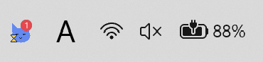
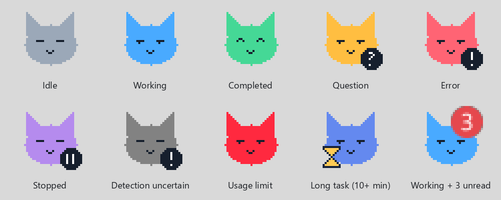
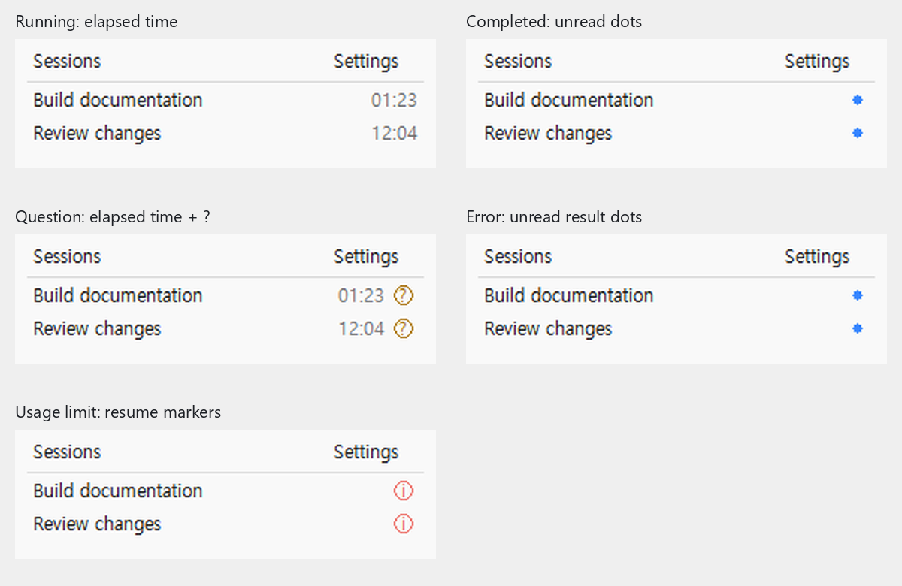

# Codex Tray Pet

> **仅支持 Windows x64，需要 Windows 版 Codex 桌面应用。不支持 macOS 和 Linux。**

[English](../../README.md) · [한국어](README.ko.md) · [日本語](README.ja.md) · [简体中文](README.zh-CN.md)

这是一个在 Windows 通知区域显示 Codex 桌面应用任务状态的小猫程序。打开会话列表即可查看正在运行的任务、问题、用量限制导致的中断和未读结果。

程序使用 C 和 Windows API 编写，运行时无需 Python、Node.js、.NET 或内嵌浏览器。这是与 OpenAI 无关联的个人项目。当前应用界面为韩语，上方链接仅切换文档语言。

## 运行效果

作者提供的真实 Windows 托盘截图：



使用程序自身的图标绘制代码生成的放大动画：



这些是放大的 32×32 图标，并非屏幕录像。保留了实际形状、颜色、徽标比例和默认 300ms 播放间隔。灰色背景接近提供的截图。静止状态保持静止。

使用相同的 Windows 窗口绘制代码和虚构标题、时间生成的示例：



运行中的行显示耗时，未读完成结果显示蓝点，问题显示带圆圈的 `?`，用量限制显示红色圆圈内的 `i`。目前普通错误的未读结果在列表中也显示蓝点，而托盘猫变为红色。示例如实呈现了这一限制。窗口标签保留了当前韩语界面。

GIF 和示例窗口均通过代码制作，没有使用 AI 图像生成或重新截取桌面。参见[图片来源和复现方法](../MEDIA.md)。

## 安装

1. 从 [Releases](https://github.com/Max-JI64/codex-tray-pet/releases) 下载 `codex-tray-pet-v0.1.1-windows-x64.zip`。
2. 解压到长期保留的目录。以后移动目录时，需要重新注册启动路径。
3. 运行 `Install.cmd`，为当前 Windows 用户注册登录计划任务并启动监视程序。
4. 如果猫被隐藏，请从通知区域的 `^` 菜单移出。

手动启动使用 `Start.cmd`。移除自动启动并停止此安装使用 `Uninstall.cmd`，文件和设置会保留。脚本不会覆盖或删除指向其他目录的同名计划任务。

安装与卸载启动器仅在自己的 PowerShell 进程中使用 `-ExecutionPolicy Bypass`，以运行下载的未签名辅助脚本，不会更改 Windows 或用户的执行策略设置。组织强制执行的策略仍可能阻止安装。更新到其他目录前，请先运行旧目录的 `Uninstall.cmd`。安装器会确认新进程持续运行后才报告成功。

支持 Windows x64 和 Codex 桌面应用，不监视 CLI、VS Code 扩展或普通 ChatGPT 应用。如果 Codex 仍在后台运行，只关闭窗口不会停止监视。在 Codex 托盘菜单选择 **Exit** 后，小猫图标会消失并释放活动资源。一个小型监视进程仍会保留，以检测下次 Codex 启动并恢复小猫。

## 状态与会话

| 状态 | 默认小猫 |
|---|---|
| 空闲 | 灰色 |
| 工作中 | 蓝色，带动画 |
| 完成 | 绿色 |
| 有问题 | 黄色，带问号 |
| 错误 | 红色，带感叹号 |
| 停止 | 紫色 |
| 检测待确认 | 深灰色 |
| 用量耗尽 | 红色闪烁和摇动 |
| 工作超过 10 分钟 | 慢动作和沙漏 |

其他任务仍在运行时也能显示未读结果数量徽标。徽标默认为红色，可在设置中更改。点击小猫打开列表，点击标题跳转到 Codex 中相应的聊天。在 Codex 中阅读结果后，会话会从未读列表中移除。列表打开期间保持行顺序。悬停在会话上可查看所属项目名称，单行弹窗优先显示在右侧，屏幕边缘则改为左侧。

## 自定义图标与设置

通过 **설정 → 아이콘 변경**（设置 → 更换图标）打开浏览器设置。可以上传一个 GIF，或最多八张 PNG/ICO。可使用所有状态共用的一组，也可为各状态分别指定。

- 每个输入文件不超过 1MiB，宽高各不超过 512px。
- GIF 原始帧数不超过 120。
- 保存格式为最多 8 帧的 32×32 RGBA，间隔 150–2,000ms。
- 使用整组共享的透明边距裁剪，保留帧间位移。自定义图标没有底部状态条。

内存中只保留当前状态的自定义帧。8 帧像素数据为 32KiB，这并不是程序总内存。进程开销、Windows 图标以及浏览器转换时的临时内存另计。浏览器设置按需在同一个原生进程内运行，没有额外常驻网页服务器或图片解码器。设置页还提供图片规范和用于 ChatGPT 的角色制作提示词。

## 检测、隐私与限制

程序读取 `CODEX_HOME` 或用户目录 `.codex` 下的本地会话记录、未读状态和项目信息，不修改 Codex 文件。登录信息中只有匹配未读状态所需的账号标识被读取到内存，不会发送到外部。

浏览器设置仅绑定 `127.0.0.1` 的临时端口，并检查访问密钥、Origin 和 Host。收到关闭请求、10 分钟没有 API 请求或 Codex 退出时关闭连接。

检测依据包括 `task_started`、`task_complete`、结构化错误和提问工具调用。仅界面中可见的变化、普通文本问题或未记录的错误可能无法识别。Codex 内部文件格式变化也可能影响检测。程序不使用官方实时状态 API，最多追踪 256 个会话，发现范围约为最近七天。大文本和图片数据通过固定缓冲区处理，仅保留状态元数据。

发布版本在作者 Windows 环境中通过了七项自动检查。已下载公开 v0.1.1 ZIP 并实际安装到这台电脑，验证了卸载、自动启动注册、进程运行、Codex 检测、托盘注册和重复安装不产生额外进程。参见[安装验证结果](../INSTALLATION-VALIDATION.md)。其他电脑安装、真实 Codex Exit 后重启和 Windows 重新登录尚未验证。可执行文件没有代码签名。

## 从源码构建

需要 Windows 64 位 [TinyCC](https://bellard.org/tcc/)，仓库不包含编译器。

```powershell
.\scripts\Build.ps1 -TccPath 'C:\tools\tcc\tcc.exe'
.\scripts\Test.ps1
.\scripts\Package.ps1
```

构建文件位于 `build`，发布 ZIP 位于 `dist`。检查覆盖解析器、大记录、状态优先级、问题、未读结果、预览覆盖、状态图标和本地设置请求。依赖真实账号或项目会话的检查已从发布源码中移除。不会发布个人会话、认证信息、诊断日志或用户上传的图标。

生成文档图片额外需要 Python 和 Pillow，但运行小猫不需要。参见 [MEDIA.md](../MEDIA.md)。

## 许可证

尚未选择分发许可证。仓库公开本身并不授予开源许可证。
